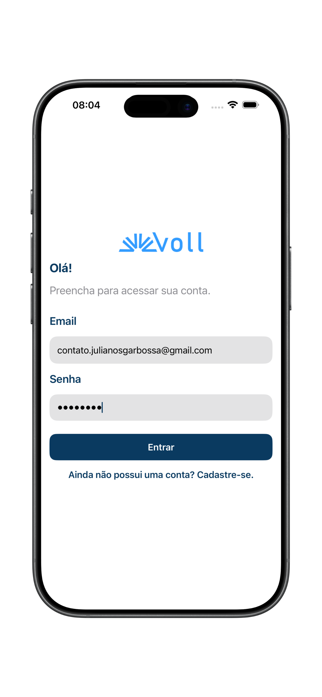
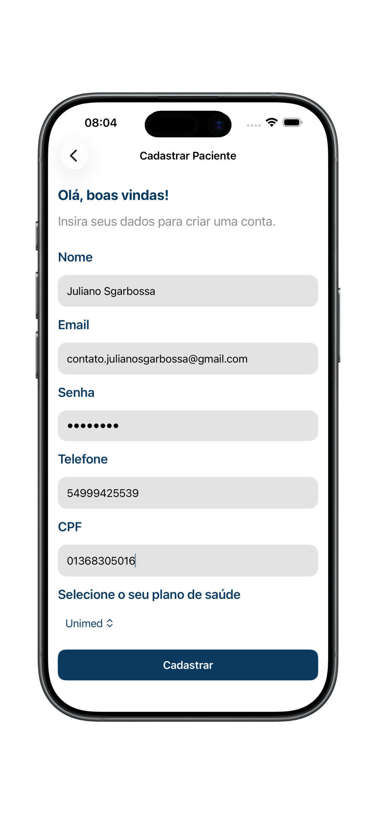
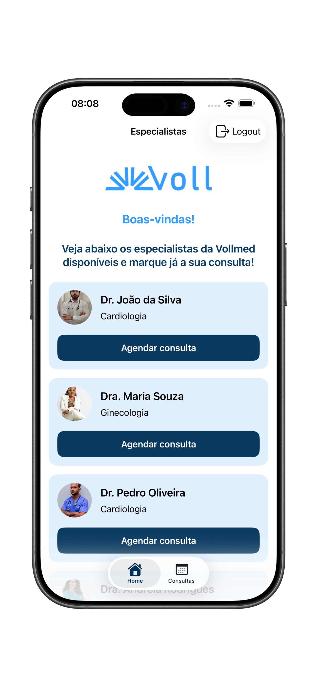
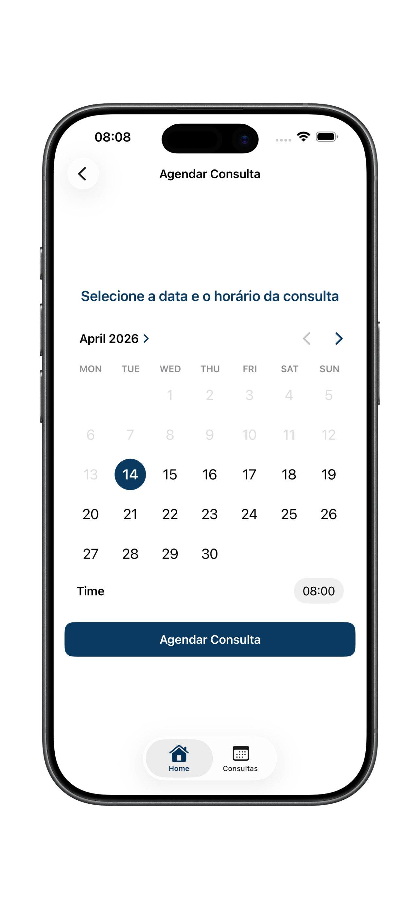
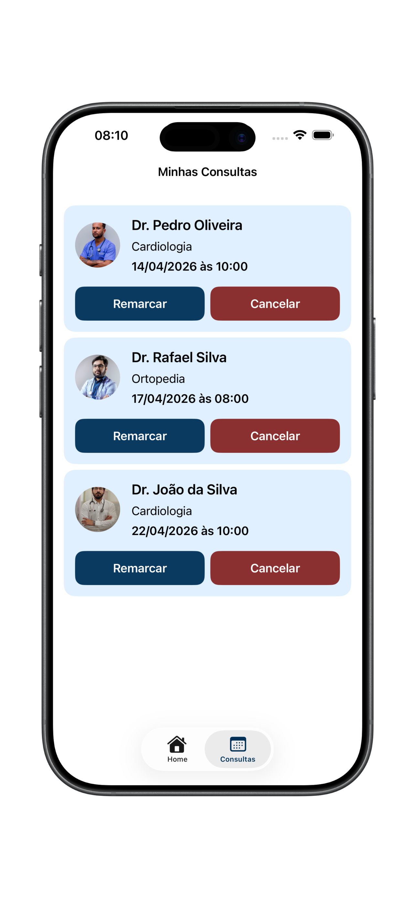

# 📱 Vollmed - App de Consultas Médicas

O **Vollmed** é um aplicativo iOS desenvolvido em **SwiftUI** para pacientes encontrarem especialistas, agendarem consultas e gerenciarem seus atendimentos. O fluxo cobre autenticação completa (cadastro, login e logout), listagem de especialistas, agendamento, reagendamento e cancelamento de consultas.

A navegação principal utiliza **TabView**, com abas para **Home** (especialistas disponíveis) e **Consultas** (consultas do paciente logado).

  
  
  
  
  

## ✨ Funcionalidades

- Cadastro de paciente
- Login e logout com autenticação por token
- Persistência segura de token e `patientId` via **Keychain**
- Listagem de especialistas disponíveis
- Download e cache de imagens dos especialistas
- Agendamento de consulta
- Reagendamento de consulta
- Cancelamento de consulta com motivo
- Listagem de consultas do paciente

## 🧭 Fluxo do App

- Usuário não autenticado:
  - Tela de **Login**
  - Navegação para **Cadastro**
- Usuário autenticado:
  - Aba **Home**: especialistas e ação para agendar
  - Aba **Consultas**: consultas marcadas com ações de remarcar/cancelar

## 🛠 Tecnologias Utilizadas

- Swift
- SwiftUI
- URLSession com `async/await`
- Codable (`JSONEncoder` / `JSONDecoder`)
- Keychain Services (armazenamento seguro)
- `NSCache` para cache de imagens
- Arquitetura em camadas simples com:
  - `Models`
  - `Views` (+ componentes reutilizáveis)
  - `Services`
  - `Managers`

## 🔌 API e Endpoints

A camada de rede está em [`WebService.swift`](Vollmed/Vollmed/Services/WebService.swift), com base URL padrão:

- `http://localhost:3000`

Endpoints consumidos:

- `GET /especialista`
- `GET /paciente/{id}/consultas`
- `POST /paciente`
- `POST /auth/login`
- `POST /auth/logout`
- `POST /consulta`
- `PATCH /consulta/{id}`
- `DELETE /consulta/{id}`

## ⚙️ Como Executar o Projeto

1. Abra um terminal e navegue até a pasta `Vollmed API`.
2. Execute `npm install`.
3. Execute `npm start` para subir a API em `http://localhost:3000`.
4. Abra o projeto no **Xcode**.
5. Se for testar em **dispositivo físico**, substitua `localhost` pelo IP da máquina no arquivo `WebService.swift`.
6. Selecione um simulador iOS (ou dispositivo).
7. Execute o app (`⌘R`).
8. Crie uma conta, faça login e navegue pelas abas para agendar/gerenciar consultas.

## 📌 Observações

Este projeto tem foco **educacional**, praticando desenvolvimento iOS com SwiftUI, integração com API REST e organização modular de código. O app já cobre operações essenciais de autenticação e ciclo completo de consultas médicas (agendar, listar, reagendar e cancelar).
